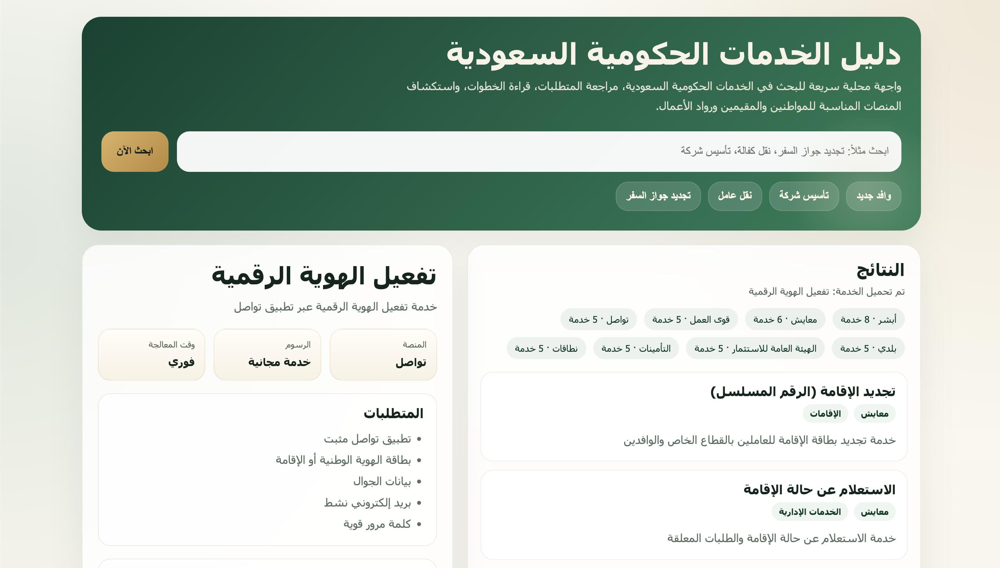

# دليل الخدمات الحكومية السعودية
## Saudi Gov Navigator


**English:** A structured knowledge base and AI chatbot agent for navigating Saudi government services seamlessly in Arabic.

## Preview



واجهة مقترحة تعرض تجربة البحث عن الخدمات الحكومية السعودية على الويب والجوال.

---

## 📖 النسخة العربية

### الوصف
**دليل الخدمات الحكومية السعودية** هو نظام ذكي متخصص في توجيه المستخدمين خلال الخدمات الحكومية السعودية المختلفة. يوفر النظام معلومات شاملة عن المنصات الحكومية الرئيسية مثل أبشر، مقيم، قوى العمل، توكلنا، بلدي، وزارة الاستثمار (MISA)، والمؤسسة العامة للتأمينات الاجتماعية.

### المزايا الرئيسية
- 🤖 **وكيل ذكي** يفهم الاستفسارات باللغة العربية
- 📚 **قاعدة معرفة شاملة** تغطي 44 خدمة حكومية عبر 8 منصات
- 🔍 **بحث دلالي** للعثور على الخدمة المناسبة بسرعة
- 💬 **واجهة محادثة تفاعلية** باللغة العربية
- 📋 **متطلبات وخطوات مفصلة** لكل خدمة
- 💰 **حاسبة الرسوم** للخدمات المدفوعة
- ⚠️ **نصائح وتنبيهات شائعة** من تجارب المستخدمين

### المنصات المدعومة
- **أبشر** (Absher): جوازات، الهويات، المخالفات المرورية
- **مقيم** (Muqeem): إقامات، نقل الكفالة، التأشيرات
- **قوى العمل** (Qiwa): العقود، نقل العمال، حماية الأجور
- **توكلنا** (Tawakkalna): الهوية الرقمية، التصاريح
- **بلدي** (Balady): التراخيص التجارية، الرخص البلدية
- **وزارة الاستثمار** (MISA): تراخيص الاستثمار، السجل التجاري
- **HRSD**: التأمينات الاجتماعية، منازعات العمل
- **نظام نطاقات** (Nitaqat): السعودة والنسب المئوية

---

## 📦 Installation

### المتطلبات
- Python 3.9+
- pip

### التثبيت المحلي

```bash
# استنساخ المشروع
git clone https://github.com/azizalzahrani/saudi-gov-navigator.git
cd saudi-gov-navigator

# إنشاء بيئة افتراضية
python -m venv venv
source venv/bin/activate  # على Windows: venv\Scripts\activate

# تثبيت المتطلبات
pip install -r requirements.txt

# تعيين متغيرات البيئة اختيارياً
cp .env.example .env
# هذا الملف اختياري. الوظائف المعتمدة على قاعدة المعرفة تعمل محلياً بدون مفاتيح API.
```

### مع Docker

```bash
docker build -t saudi-gov-navigator .
docker run --rm -p 8000:8000 saudi-gov-navigator
# ثم افتح http://127.0.0.1:8000
```

---

## 🚀 الاستخدام

### 1. واجهة المحادثة التفاعلية

```bash
python -m saudi_gov.chatbot
```

ثم أدخل استفسارك باللغة العربية:
```
👤 أنت: كيف أجدد جواز سفري؟
🤖 الوكيل: أهلاً! يمكنك تجديد جواز السفر من خلال منصة أبشر...
```

### 1.1 واجهة ويب محلية

```bash
python -m saudi_gov.webapp --host 127.0.0.1 --port 8000
```

ثم افتح:

```text
http://127.0.0.1:8000
```

يمكنك أيضاً استخدام الأمر المختصر بعد التثبيت:

```bash
saudi-gov-web --port 8000
```

### 2. الاستعلام البرمجي

```python
from saudi_gov.agents import NavigatorAgent

agent = NavigatorAgent()
response = agent.answer("كيف أنقل عاملي في مقيم؟")
print(response)
```

### 3. البحث الدلالي

```python
from saudi_gov.search import SemanticSearch

search = SemanticSearch()
results = search.find_service("تجديد الإقامة")
for service in results:
    print(f"{service['name_ar']} - {service['platform']}")
```

### 4. البحث عن متطلبات الخدمة

```python
from saudi_gov.agents import RequirementsAgent

agent = RequirementsAgent()
requirements = agent.get_requirements("تجديد جواز السفر")
print(requirements)
```

---

## 🏗️ البنية المعمارية

```
saudi_gov/
├── knowledge_base/       # قاعدة المعرفة (JSON)
│   ├── absher.json      # خدمات أبشر
│   ├── muqeem.json      # خدمات مقيم
│   ├── qiwa.json        # خدمات قوى العمل
│   ├── tawakkalna.json  # خدمات توكلنا
│   ├── balady.json      # خدمات بلدي
│   ├── misa.json        # خدمات الاستثمار
│   ├── hrsd.json        # خدمات التأمينات
│   └── nitaqat.json     # نطاقات السعودة
├── agents/              # وكلاء التنقل والبحث
│   ├── navigator_agent.py      # الوكيل الرئيسي
│   ├── service_finder.py       # البحث عن الخدمات
│   ├── requirements_agent.py   # الحصول على المتطلبات
├── chatbot.py           # واجهة المحادثة
├── search.py            # البحث الدلالي
├── config.py            # الإعدادات
└── utils/               # أدوات مساعدة
    ├── arabic_utils.py  # معالجة النصوص العربية
    └── fee_calculator.py # حاسبة الرسوم
```

### البنية الكاملة للخدمة

كل خدمة تحتوي على:
- الاسم والوصف بالعربية والإنجليزية
- المتطلبات الوثائقية
- الخطوات التفصيلية
- الرسوم والوقت المتوقع
- الأخطاء الشائعة
- النصائح والملاحظات

---

## 💻 أمثلة

### مثال 1: تجديد جواز السفر

```python
from saudi_gov.agents import NavigatorAgent

agent = NavigatorAgent()
response = agent.answer("أنا أريد تجديد جواز سفري، ما الخطوات؟")
print(response)
```

### مثال 2: دليل الوافدين

```python
from saudi_gov.agents import NavigatorAgent

agent = NavigatorAgent()
response = agent.answer("أنا وافد جديد، ما الخدمات التي أحتاجها؟")
print(response)
```

### مثال 3: بدء نشاط تجاري

```bash
python examples/business_setup.py
```

---

## 🔧 المتطلبات

- Python 3.9 أو أحدث — البحث وقاعدة المعرفة والواجهات تعمل بالمكتبة القياسية فقط
- `python-dotenv` (اختياري) لتحميل ملف `.env`
- أدوات التطوير والاختبار: `pip install -r requirements-dev.txt` أو `pip install -e ".[dev]"`

---

## ⚖️ الترخيص والتنبيهات

### ⚠️ تنبيه مهم
**هذا المشروع غير تابع لأي جهة حكومية رسمية.** الهدف منه توفير معلومات مرجعية تعليمية حول الخدمات الحكومية السعودية استناداً إلى المصادر الرسمية العامة. لا يعتمد المشروع على تكاملات حكومية مباشرة أو مفاتيح API لتشغيل البحث المحلي والأمثلة الأساسية.

### الإخلاء من المسؤولية
- جميع المعلومات مقدمة "كما هي" دون ضمانات
- يجب التحقق من المعلومات الحالية عبر المنصات الرسمية
- لا نتحمل مسؤولية أي أخطاء أو تأخيرات في الخدمات

### الترخيص
هذا المشروع مرخص تحت **MIT License** - انظر ملف [LICENSE](LICENSE) للتفاصيل.

---

## 🤝 المساهمة

نرحب بمساهمتك! يمكنك:
- تحديث قاعدة المعرفة بخدمات جديدة
- تحسين دقة المعلومات
- إضافة ترجمات
- الإبلاغ عن الأخطاء

يرجى اتباع [CONTRIBUTING.md](CONTRIBUTING.md) للتفاصيل.

---

## 📞 الدعم

- **GitHub Issues**: للإبلاغ عن المشاكل والاقتراحات
- **Discussions**: للنقاشات والأسئلة
- **وثائق المشروع**: انظر [docs/](docs/) للمزيد

---

## 👨‍💻 المؤلف

**Aziz Al-Zahrani** - [GitHub](https://github.com/azizalzahrani)

جزء من سلسلة **Arabic AI Toolkit**.

---

## 📊 الإحصائيات

- خدمات مغطاة: 44
- منصات: 8
- وثائق بالعربية: ✅
- بحث عربي مع تطبيع النصوص ومعالجة السوابق واللواحق: ✅

---

## 🗺️ خارطة الطريق

- [ ] دعم المصادقة متعددة المشروع
- [ ] تطبيق الجوال (React Native)
- [ ] دعم اللهجات الإقليمية
- [ ] تكامل مع المحافظ الرقمية
- [ ] واجهة ويب متقدمة

---

## 📝 ملاحظة حول البيانات

جميع البيانات في هذا المشروع مأخوذة من المصادر الرسمية العامة:
- المواقع الرسمية للجهات الحكومية
- الإعلانات الرسمية والنشرات
- التقارير والإحصائيات المنشورة

**آخر تحديث:** يونيو 2026

---

**استمتع بتجربة أفضل مع الخدمات الحكومية السعودية!** 🇸🇦
